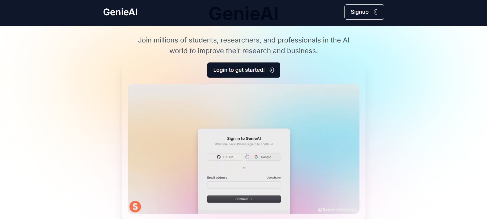

# GenieAI ✨


## Table of Contents 📚

- [Project Overview](#project-overview)
- [Technology and Tools](#technology-and-tools)
- [Project Setup](#project-setup)
- [Deployment](#deployment)
- [Dependencies Issue](#dependencies-issue)
- [How to Contribute](#how-to-contribute)
- [Contribution Points](#contribution-points)
- [GSSoC Guidelines](#gssoc-guidelines)
- [Acknowledgements](#acknowledgements)
- [Thanks to Contributors](#thanks-to-contributors)

## Project Overview 📝

**Project Name:** GenieAI

This web-based application leverages a range of technologies, tools, and frameworks to provide an efficient chat and PDF management system.


## Technology and Tools 🛠️

- 📍**Next.js**: A React framework for production that adds features such as static exporting and server-side rendering to your React applications.
- 📍**TypeScript**: An open-source language built on JavaScript by adding static type definitions.
- 📍**Eslint**: A tool for identifying and reporting on patterns in JavaScript.
- 📍**Tailwind CSS**: A highly customizable, low-level CSS framework.
- 📍**Node Package Manager (NPM)**: The package manager for Node.js to install necessary packages.
- 📍**VS Code**: A code editor for building and debugging web and cloud applications.
- 📍**Shadcn-ui**: A popular Tailwind CSS framework to design amazing UI.
- 📍**Drizzle ORM**: A popular TypeScript-based PostgreSQL ORM that works with edge runtime.
- 📍**Pinecone**: A cloud-based fast vector database storage provider.
- 📍**Clerk**: A powerful authentication provider with effortless integration.

## Project Setup ⚙️

1. **Initialize the project**: 
   - Run the following command in the terminal:
     ```bash
     npx create-next-app@latest --typescript
     ```
   - When prompted, name the project **"GenieAI"**. Ensure to use the TypeScript flag.

2. **Open the project**: 
   - Change the directory to the project root folder `GenieAI`:
     ```bash
     cd genieai
     ```
   - Open the project in VS Code:
     ```bash
     code .
     ```

3. **Add Environmental Variables to .env file**: 
   - Get the environment variables from the given database URL and add those to your `.env` file in the form of key-value pairs. The file should look like this:
     ```
     DATABASE_URL={Your Database URL here}
     NEXT_BASE_URL={Your Next base URL here}
     ```
   - Ensure that there are no white spaces or lines.

4. **Setup Next Base URL (Optional)**: 
   - List the Next base URL in the environmental variables section of your project. Update it later with the one provided by the platform you choose for deployment.

5. **Run the project**: 
   - To verify that the project is set up correctly, run:
     ```bash
     npm run dev
     ```
   - Visit `localhost` to check whether everything is working fine.

## Deployment 🚀

When ready to deploy, update the `NEXT_BASE_URL` variable in your `.env` file with the Vercel URL or the URL provided by your deployment platform. Please note that more specific changes might be required according to the needs of the project.

## Dependencies Issue ⚠️

Peer dependency issues for React with Clerk and Drizzle ORM can cause problems, so use the `peer dependency` flags.

## How to Contribute to This Project⛓️

We’re excited to have you contribute to the **GenieAI** project! Follow these simple steps to get started:

1. **🍴 Fork the Repository**  
   - Go to the [repository page](https://github.com/satyam8932/genieai).
   - Click the *Fork* button (top right) to create a copy in your GitHub account.

2. **💻 Clone Your Fork**  
   - Open your terminal and run:
     ```bash
     git clone https://github.com/your-username/genieai.git
     ```
   - Replace `your-username` with your GitHub username.

3. **🌿 Create a New Branch**  
   - Create a new branch for your work:
     ```bash
     git checkout -b your-branch-name
     ```

4. **🛠️ Make Your Changes**  
   - Open the project files in your code editor and make your changes.
   - Contact the project manager [Satyam Singh](https://github.com/satyam8932) for any queries.

5. **✅ Test Your Changes**  
   - Test your changes locally by running the application.

6. **💬 Commit Your Changes**  
   - Once ready, commit them with a descriptive message:
     ```bash
     git add .
     git commit -m "Added feature X or Fixed issue Y"
     ```

7. **📤 Push Your Changes**  
   - Push your changes to your forked repository:
     ```bash
     git push origin your-branch-name
     ```

8. **🔄 Create a Pull Request (PR)**  
   - Go back to the original repository [here](https://github.com/satyam8932/genieai).
   - Click the *Compare & pull request* button, write a short description of your changes, and submit the PR.

9. **🔎 Review Changes**  
   - The project manager will review your PR, and if approved, your request will be merged.

## 🏆 Contribution Points

Every issue raised will be provided with a level based on the amount of efforts required to complete it. Points awarded based on levels are-
- **🥇 Level 1**: 10 Points  
- **🥈 Level 2**: 25 Points  
- **🥉 Level 3**: 45 Points  

## 📃 GSSoC Guidelines 

It is important to adhere to the guidelines; violations can affect your profile. Review the guidelines [here](https://github.com/GSSoC24/Contributor/tree/main/gssoc-guidelines).

---

# 🎉 Big thanks to all the contributors!

<a href="https://github.com/satyam8932/genieai/pulse">
  
</a>

---

## ⏱️ Final Note

Thank you for taking the time to explore the **GenieAI** project! Your contributions, feedback, and support are invaluable to us. Together, let's make this project even better! If you have any questions or suggestions, feel free to reach out. If you find this project helpful, please consider giving it a ⭐️! Your support motivates us to continue improving and maintaining this project.

